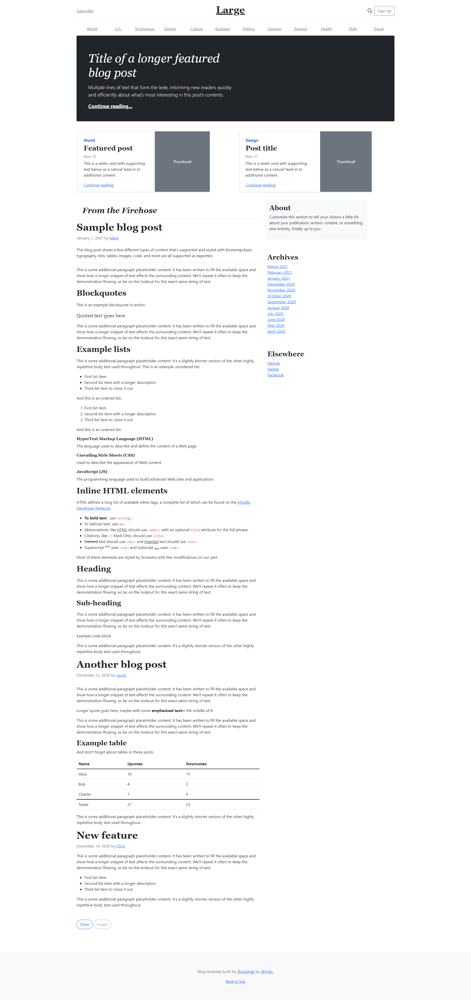
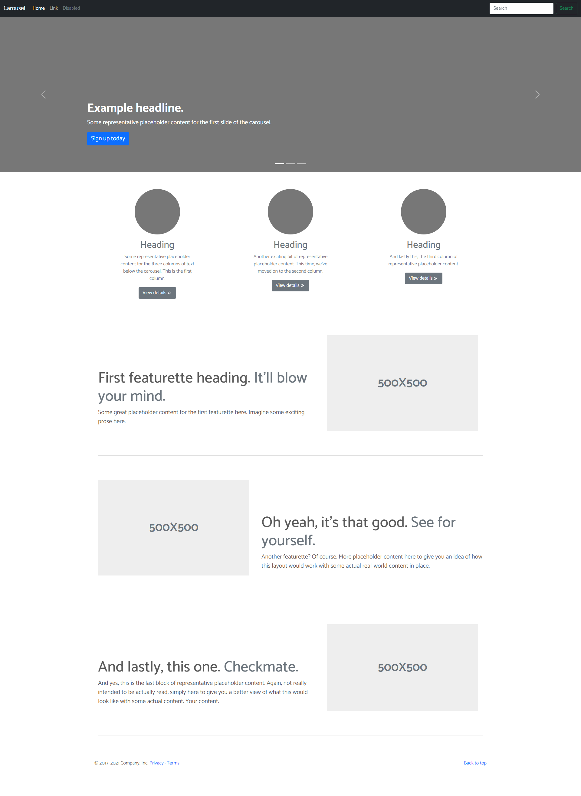

## General info

I cloned the bootsrap carousel and made the blog samples section look largely similar, and added a few nice things of my own (responsive)
img



## Technologies

Project is created with;

* Bootstrap 5.1.3
* mi icons
* data aos
* Jquery 3.7.0
* Bootstrap5.1.3Bundle
* owl.carousel

## Cloning the Project

```bash
git clone git@github.com:cengizVenes/bootsrap-comp.git
```